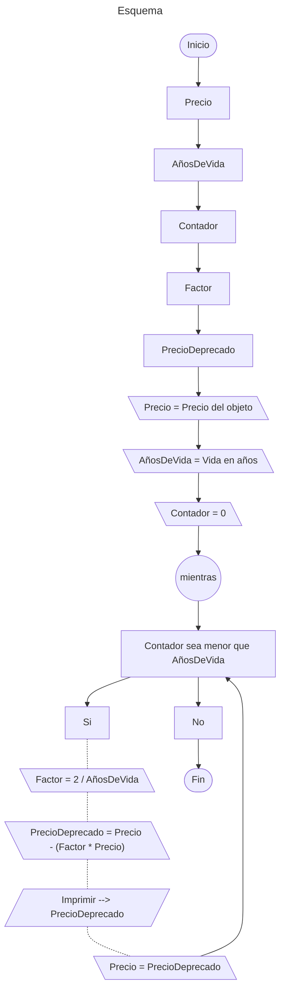

# Cálculo de deprecación de un objeto por el método del balance doblemente declinante

## Enunciado del problema

Realice un programa en `<lenguaje de programación>` que calcule la depreciación de un objeto según el método del balance doblemente declinante. En este método, el valor del objeto disminuye cada año en un porcentaje constante. Por tanto, la verdadera cantidad depreciada, en dólares, variará de un año al siguiente

## Análisis paso por paso

Para obtener el factor de depreciación, supongamos que tenemos un objeto cuyo valor es de 8000 y queremos depreciarlo por 10 años:

1. Dividimos 2 entre los años de vida del objeto: `2 / 10 = 0.2`
2. Multiplicamos el factor obtenido por el precio del objeto: `8000 * 0.2 = 1600`
3. Ahora el precio del objeto es de `8000 - 1600 = 6400`
4. Luego hacemos lo mismo del paso **2**, pero con el precio depreciado por el paso **3**, es decir `6400 * 0.2 = 1280` en el primer año. Luego cada repeticion tendra un precio diferente.
5. Repetimos el mismo proceso 10 veces, o sea la misma cantidad de años de vida que queremos depreciar

### Gráfica



### Ejemplo en Pascal

```pascal
program balanceDoblementeDeclinante;

const
    PORTCENTAJE = 2;

var
    nombreObjeto: String[20];
    precio: Real;
    vidaUtil: Integer;
    factorDepreciacion: Real;
    contador: Integer;
    precioDeprecado: Real;

begin
    write('Escribe el nombre del objeto: ');
    readLn(input, nombreObjeto);

    write('Escribe el precio objeto: ');
    readLn(input, precio);

    write('Escribe la vida util del objeto: ');
    readLn(input, vidaUtil);

    for contador := 1 to vidaUtil do
    begin
        factorDepreciacion := PORTCENTAJE / vidaUtil;
        precioDeprecado := precio - (precio * factorDepreciacion);
        precio := precioDeprecado;
        writeLn('Precio de ', nombreObjeto, ' a ', contador, ' años de deprecacion: ', Round(precio));
    end;

end.
```

### Ejemplo en Python

```python

precio = float(input("Precio del objeto: "))
vida = int(input("Años de vida del objeto: "))

factor = 2 / vida
for contador in range(vida):
    precio_deprecado = precio - (factor * precio)
    print(f"precio depreciado a {contador + 1} años de vida: {precio_deprecado}")
    precio = precio_deprecado
```
